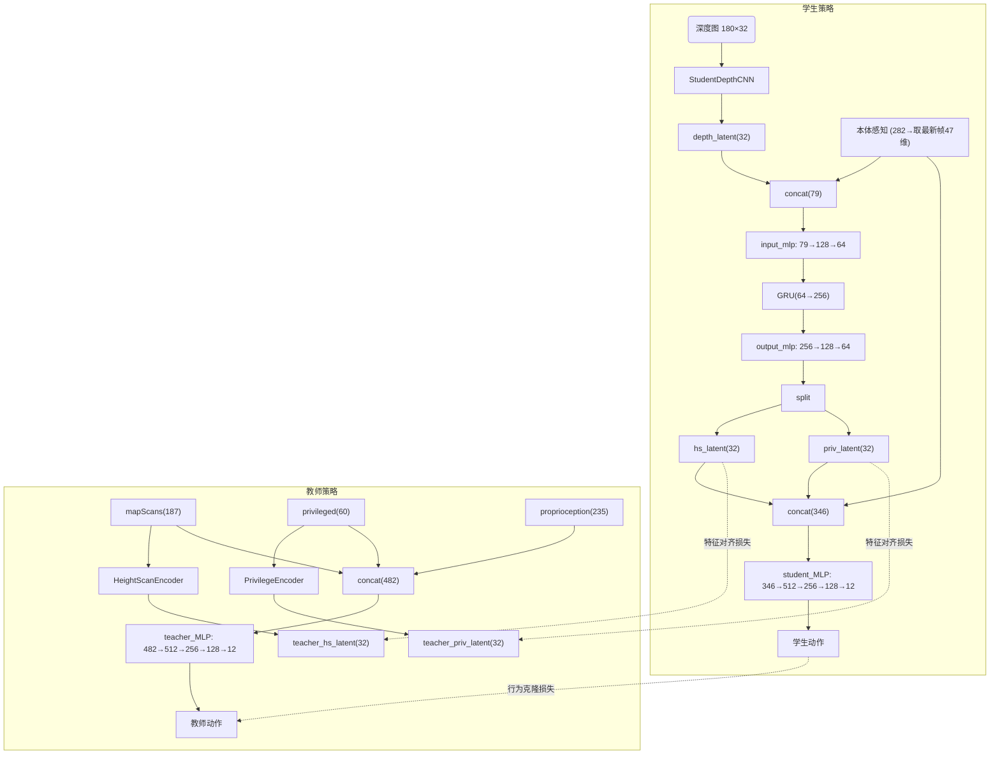
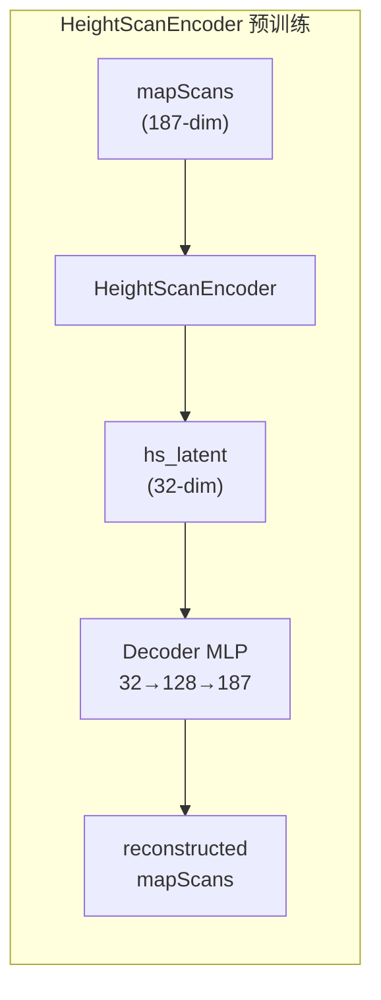
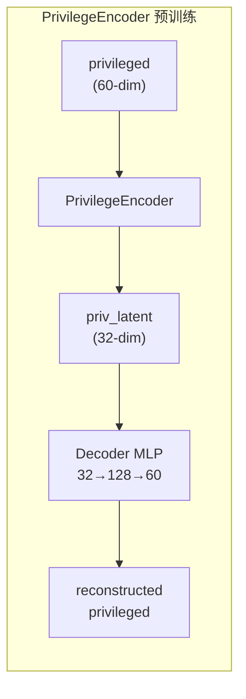

# Go2 Mid360 Depth GRU 学生策略架构重设计方案

> **版本**: v0.1  
> **日期**: 2026-08-04  
> **状态**: 方案设计阶段，待评审  

---

## 一、背景与问题诊断

### 1.1 v0.1.5 失败原因分析

v0.1.5 增大了深度图 CNN 模块参数量（`DepthImageEncoder` 的参数量扩张），但训练效果反降（地形可达等级从 4.5 降至 3.0-3.5）。根因分析：

- **过度参数化**：CNN 通道数过度扩张导致过拟合仿真噪声
- **缺乏时序建模**：学生策略仅用单帧深度图 + 全量本体观测历史拼接，无 GRU 时序融合
- **特征维度不匹配**：深度特征 192-dim 直接拼入 MLP，信息冗余且缺乏压缩

### 1.2 当前 GRU 配置的关键 BUG

文件 `agents/rsl_rl_distillation_cfg_walk_mid360_depth_10hz_gru.py` 中使用了 `RslRlDistillationStudentTeacherDepthImageCfg`，其 `class_name = "StudentTeacherDepthImage"` — **`is_recurrent = False`，GRU 从未被启用**。

配置名叫 `_gru` 但实际运行时全程无时序状态，这是配置结构已建但细节未完善的遗留问题。

---

## 二、参考架构：extreme Parkour 设计

详见 `docs/ref_analysis_docs/depth_feature_extraction_analysis.md`，核心设计模式：

```
深度图 → CNN → depth_latent(32)
本体感知 ──────────────┬→ concat → combination_mlp → GRU(512) → output_mlp → split(32+2)
                       │                                                      ├→ depth_latent(32)
                       │                                                      └→ yaw(2)
                       └→ 同时用于 student action MLP
```

关键洞察：
1. **紧凑 latent**：CNN 输出 32-dim（而非 192-dim）
2. **GRU 时序融合**：补偿低帧率（10Hz）感知
3. **特征对齐**：depth_latent 维度与教师 scan_encoder 输出对齐

---

## 三、新架构总体设计

### 3.1 设计原则

1. **增量式改动**：新建文件为主，不修改现有运行中的代码（除 `__init__.py` 和 config）
2. **参数控制**：CNN 参数量控制在 ~30K（避免重蹈 v0.1.5 覆辙）
3. **可回退**：通过配置切换即可回退到旧架构

### 3.2 整体数据流



### 3.3 关键维度一览

| 观测组 | 每帧维度 | history_length | 总维度 | 提取方式 |
|--------|---------|---------------|--------|---------|
| teacher `proprioception` | 47 | 5 | 235 | 全量 → teacher_MLP |
| teacher `mapScans` | 187 (17×11) | 1 | 187 | 全量 → HeightScanEncoder / teacher_MLP |
| teacher `privileged` | 20 | 3 | 60 | 全量 → PrivilegeEncoder / teacher_MLP |
| student `proprioception_noised` | 47 | 6 | 282 | **取最后47维** → GRU input; 全量 → student_MLP |
| student `mid360_depth` | 5760+1 | 1 | 5761 | 前5760 → CNN; 末1(age) → 丢弃 |

### 3.4 参数量估算

| 组件 | 参数量 | 说明 |
|------|--------|------|
| HeightScanEncoder | ~13K | Conv2d(1→16→32) + Pool |
| PrivilegeEncoder | ~7K | MLP(60→64→32) |
| StudentDepthCNN | ~30K | Conv2d(1→16→32→64) + FC |
| Memory(GRU, 64→256) | ~247K | 1层 GRU |
| input_mlp(79→128→64) | ~27K | |
| output_mlp(256→128→64) | ~49K | |
| student_MLP(346→512→256→128→12) | ~337K | |
| teacher_MLP(482→512→256→128→12) | ~443K | **冻结，不训练** |
| **可训练参数总计** | **~710K** | |

相比原 `StudentTeacherDepthImage`（student 侧 ~3.3M），参数减少约 **78%**。

---

## 四、实施步骤

### Step 1: 新建 Teacher 辅助编码器 — `rsl_rl/networks/teacher_encoders.py`

创建两个轻量编码器，用于定义蒸馏 latent 空间维度标准。

#### 1a) `HeightScanEncoder` — 高度扫描特征编码器

```
输入: [B, 187] → reshape [B, 1, 11, 17]
Conv2d(1→16, k=5, p=2) → ELU
Conv2d(16→32, k=5, p=2) → ELU
AdaptiveAvgPool2d(1) → [B, 32, 1, 1] → flatten → [B, 32]
```

- 参考 `ScanCNNEncoder` 的极简设计风格
- 保持空间尺寸不变，最后通过全局池化压缩
- 输出 32-dim compact latent

#### 1b) `PrivilegeEncoder` — 特权信息编码器

```
输入: [B, 60] (20-dim × history=3)
MLP(60→128→64→32, activation="elu")
输出: [B, 32]
```

---

### Step 2: 新建 Student Depth CNN — `rsl_rl/networks/student_depth_cnn.py`

> **重要说明**：这是**全新文件**，专供 GRU 蒸馏环境使用。
> 现有的 [`DepthImageEncoder`](file:///d:/GitSyncVaults/IsaacLab2.3/rsl_rl/networks/depth_image_encoder.py) **保持不动**，
> 继续服务于 `Go2-Loco-Skill-Walk-Mid360Depth-10Hz`（非 GRU 版本）环境，两个模块各自独立、互不干扰。

相比 `DepthImageEncoder`（192-dim 输出、avg+max+min 三池化），本设计更紧凑：

```
输入: [B, 1, 32, 180] (NCHW)
水平循环 padding (border wrap) → 处理 360° LiDAR 的循环特性

Conv2d(1→16, k=5, s=1, p=2) → ELU        → [B, 16, 32, 180]
Conv2d(16→32, k=5, s=2, p=2) → ELU       → [B, 32, 16, 90]
Conv2d(32→64, k=5, s=2, p=2) → ELU       → [B, 64, 8, 45]
AdaptiveAvgPool2d(1) → [B, 64, 1, 1] → flatten → [B, 64]
Linear(64→32) → [B, 32]
```

设计要点：
- 3 层 Conv 逐步下采样（2×2 = 4× 总下采样），与参考设计的轻量风格一致
- 全局平均池化（非 avg+max+min 三池化），减少特征冗余
- 输出 32-dim，与教师 encoder 输出维度对齐
- **参数量 ~30K**（原 `DepthImageEncoder` 为 ~56K）

---

### Step 2.5: Teacher 辅助编码器预训练策略（关键设计决策）

#### 问题诊断

原方案存在**训练逻辑缺陷**：若 Teacher 的 `HeightScanEncoder` 和 `PrivilegeEncoder` 仅在学生蒸馏阶段参与训练，存在两难：
- **detach 教师 encoder** → encoder 永远停在随机初始化，学生对齐噪声，无意义
- **不 detach 教师 encoder** → 学生与教师 encoder 双向奔赴，latent 坍塌到平凡解（如全零）

因此，**教师辅助编码器必须在蒸馏开始前获得有意义的权重**。

#### 解决方案：自监督 AutoEncoder 预训练

在 Stage3 教师 PPO 训练**完成后**、Stage4 学生蒸馏**开始前**，插入一个轻量预训练步骤：





**数据来源**：
- **VecEnv rollout 实时采样**（参考 [`play.py`](file:///d:/GitSyncVaults/IsaacLab2.3/scripts/reinforcement_learning/rsl_rl/play.py) 模式）：启动 Isaac Sim → 加载 Stage3 教师 checkpoint → 教师策略驱动环境 rollout
- 从 `env.step()` 返回的 `TensorDict` 中按 key 提取 `obs["mapScans"]` 和 `obs["privileged"]`（无需动作标签）
- 同一 `TensorDict` 同时用于策略推理（`act_inference` 自动拼接 3 组观测）和数据收集（按 key 提取原始观测），**推理与收集零额外开销**

**训练流程**：
1. 教师策略 rollout 采集观测数据（`mapScans` 和 `privileged`），存入固定容量环形缓冲区
2. 边 play 边 train：每 100 环境步（≈ 409K 新样本）训练两个 AutoEncoder 各 10 epoch
3. MSE 重建损失分别训练两个 AutoEncoder（收敛快，总环境步 < 2000 即可）
4. 预训练完成后，丢弃 Decoder，仅保留 Encoder 权重
5. 将 Encoder 设为 `eval()` 模式 + 冻结参数，作为蒸馏阶段的稳定目标

> 详细设计（缓冲区、训练循环伪代码、CLI 接口等）见下方「预训练脚本详细设计」。

**理论可行性**：
- 重建损失保证 latent 保留了输入的**信息量**（互信息最大化下界）
- 32-dim 瓶颈强制压缩，天然过滤噪声、保留主导因素
- 冻结后为学生提供**固定的、有意义的对齐目标**，而非移动靶
- 教师策略 rollout 确保数据分布与蒸馏阶段一致（同环境、同地形、同策略）

**为什么不直接在教师 PPO 中训练 encoder**：
- 改动教师训练架构会破坏已收敛的 Stage3 checkpoint，需要重新训练（成本高）
- AutoEncoder 独立于 RL 目标，不影响教师策略效果
- 预训练后的 encoder 是可插拔的——未来若发现更好的预训练方式，可直接替换
- 实时 rollout 无需修改 Stage3 训练脚本，零侵入

#### 代码实现要点

Teacher encoders 设计为**自带 decoder 的 AutoEncoder 类**，对外暴露 `encode()` / `decode()` / `forward()` 接口：

```python
class HeightScanEncoder(nn.Module):
    """Height scan AutoEncoder — 压缩 187-dim mapScans → 32-dim latent → 重建。

    编码器（与 Step 1 的最终定义一致）：
        输入: [B, 187] → reshape [B, 1, 11, 17]
        Conv2d(1→16, k=5, p=2) → ELU → [B, 16, 11, 17]
        Conv2d(16→32, k=5, p=2) → ELU → [B, 32, 11, 17]
        AdaptiveAvgPool2d(1) → [B, 32, 1, 1] → flatten → [B, 32]

    解码器：
        Linear(32→128) → ELU → Linear(128→187) → [B, 187]
    """
    def __init__(self, latent_dim: int = 32):
        super().__init__()
        self.encoder = nn.Sequential(
            # Conv layers...（见 Step 1 完整定义）
        )
        self.decoder = nn.Sequential(
            nn.Linear(latent_dim, 128),
            nn.ELU(),
            nn.Linear(128, 187),
        )

    def encode(self, x: torch.Tensor) -> torch.Tensor:
        """x: [B, 187] → [B, 32]"""
        return self.encoder(x)

    def decode(self, z: torch.Tensor) -> torch.Tensor:
        """z: [B, 32] → [B, 187]"""
        return self.decoder(z)

    def forward(self, x: torch.Tensor) -> torch.Tensor:
        """完整 AutoEncoder 前向：x → encode → decode → x_recon"""
        return self.decode(self.encode(x))


class PrivilegeEncoder(nn.Module):
    """Privilege AutoEncoder — 压缩 60-dim privileged → 32-dim latent → 重建。

    编码器（与 Step 1 的最终定义一致）：
        MLP(60→128→64→32, activation="elu")

    解码器：
        MLP(32→64→128→60, activation="elu")
    """
    def __init__(self, latent_dim: int = 32):
        super().__init__()
        self.encoder = nn.Sequential(
            nn.Linear(60, 128), nn.ELU(),
            nn.Linear(128, 64), nn.ELU(),
            nn.Linear(64, latent_dim),
        )
        self.decoder = nn.Sequential(
            nn.Linear(latent_dim, 64), nn.ELU(),
            nn.Linear(64, 128), nn.ELU(),
            nn.Linear(128, 60),
        )

    def encode(self, x: torch.Tensor) -> torch.Tensor:
        """x: [B, 60] → [B, 32]"""
        return self.encoder(x)

    def decode(self, z: torch.Tensor) -> torch.Tensor:
        """z: [B, 32] → [B, 60]"""
        return self.decoder(z)

    def forward(self, x: torch.Tensor) -> torch.Tensor:
        """完整 AutoEncoder 前向：x → encode → decode → x_recon"""
        return self.decode(self.encode(x))
```

> **注意**：上述类定义最终应沉淀到 `rsl_rl/networks/teacher_encoders.py`（Step 1）。
> 预训练脚本可暂时内联定义，待 Step 1 完成后改为 import。

---

#### 预训练脚本详细设计 — `scripts/tools/pretrain_teacher_encoders.py`

##### 整体架构

参考 [`play.py`](file:///d:/GitSyncVaults/IsaacLab2.3/scripts/reinforcement_learning/rsl_rl/play.py) 的 Isaac Sim 启动 + 环境创建 + checkpoint 加载模式，差异在于 play loop 中**交替进行数据收集和 encoder 训练**：

```
┌──────────────────────────────────────────────────────────┐
│  Phase 1: Setup（同 play.py）                             │
│  AppLauncher → env → RslRlVecEnvWrapper → OnPolicyRunner │
│  → runner.load(stage3_checkpoint)                        │
│  → policy = runner.get_inference_policy()  # act_inference│
├──────────────────────────────────────────────────────────┤
│  Phase 2: 创建 AutoEncoder 模型 + Adam 优化器             │
│  hs_ae = HeightScanEncoder()   # 含 encoder + decoder    │
│  priv_ae = PrivilegeEncoder()  # 含 encoder + decoder    │
├──────────────────────────────────────────────────────────┤
│  Phase 3: Play+Train 交替循环                             │
│  for step in range(total_collect_steps):                  │
│      # --- Play: 教师策略推理（no grad）---                │
│      with torch.inference_mode():                         │
│          actions = policy(obs)   # obs 是 TensorDict      │
│          obs, _, dones, _ = env.step(actions)             │
│          buffer.add(obs["mapScans"], obs["privileged"])  │
│                                                           │
│      # --- Train: 每 K 步训练一次 encoder ---             │
│      if step % train_every == 0 and buffer.size >= min:   │
│          for epoch in range(train_epochs):                │
│              loss = MSE(ae(buffer.data), buffer.data)     │
│              loss.backward() → optimizer.step()           │
│                                                           │
│      # --- Save: 每 S 次训练后保存 encoder 权重 ---       │
│      if training_iter % save_every == 0:                  │
│          torch.save(ae.encoder.state_dict(), ...)         │
├──────────────────────────────────────────────────────────┤
│  Phase 4: 最终保存（丢弃 decoder）                         │
│  save: height_scan_encoder.pt / privilege_encoder.pt      │
└──────────────────────────────────────────────────────────┘
```

##### 数据流设计

**关键认知**：`RslRlVecEnvWrapper.step()` 返回的 `obs` 是 `TensorDict`，包含所有观测组（key=组名，value=[num_envs, group_dim]）。教师策略的 `act_inference(obs)` 内部通过 `get_actor_obs()` 自动提取 `["proprioception", "mapScans", "privileged"]` 并拼接，因此**同一个 TensorDict 既可用于策略推理，也可按 key 取出原始观测用于 encoder 训练**。

```python
# env.step() 返回的 TensorDict 结构（以 4096 并行环境为例）：
obs = TensorDict({
    "proprioception":   torch.Size([4096, 235]),   # 47-dim × history=5
    "mapScans":         torch.Size([4096, 187]),   # 187-dim × history=1
    "privileged":       torch.Size([4096, 60]),    # 20-dim × history=3
    # 学生观测组为 None，不参与教师推理
}, batch_size=[4096])

# 策略推理（自动拼接 → 482-dim → actor MLP → 12-dim action）:
actions = policy(obs)

# 提取 encoder 训练数据:
map_scans_batch = obs["mapScans"]       # [4096, 187]
privileged_batch = obs["privileged"]    # [4096, 60]
```

##### 缓冲区设计

使用固定容量的环形缓冲区，避免显存无限增长：

```python
@dataclass
class ObsBuffer:
    """固定容量观测缓冲区。"""
    capacity: int          # 最大样本数，如 200_000
    map_scans: Tensor      # [capacity, 187]，-1 填充未使用位置
    privileged: Tensor     # [capacity, 60]
    write_ptr: int = 0     # 当前写入位置
    full: bool = False     # 是否已写满一轮

    def add(self, ms: Tensor, priv: Tensor) -> None:
        """添加一批观测。ms/priv: [num_envs, dim]"""
        n = ms.shape[0]
        end = min(self.write_ptr + n, self.capacity)
        self.map_scans[self.write_ptr:end] = ms[:end - self.write_ptr]
        self.privileged[self.write_ptr:end] = priv[:end - self.write_ptr]
        self.write_ptr = (self.write_ptr + n) % self.capacity
        if self.write_ptr == 0:
            self.full = True

    def get_valid(self) -> tuple[Tensor, Tensor]:
        """返回所有有效数据 [valid_samples, dim]"""
        n = self.capacity if self.full else self.write_ptr
        return self.map_scans[:n], self.privileged[:n]
```

##### 训练循环伪代码

```python
def pretrain_teacher_encoders(
    checkpoint_path: str,                   # ① Stage3 teacher checkpoint（--checkpoint）
    total_steps: int = 2000,
    train_every: int = 100,
    train_epochs: int = 10,
    batch_size: int = 4096,
    save_every: int = 5,
    push_interval: int = 300,              # ② 推力扰动间隔（0=禁用）
    encoder_checkpoint: str | None = None,  # ③ 已有 encoder 权重（warm start）
):
    # === Phase 1: Setup（同 play.py） ===
    env = RslRlVecEnvWrapper(gym.make(task, cfg=env_cfg))
    runner = OnPolicyRunner(env, agent_cfg.to_dict(), log_dir=None, device=device)
    runner.load(checkpoint_path)
    policy = runner.get_inference_policy(device=env.unwrapped.device)

    # === Phase 1.5: 生成输出路径（对齐 train.py 风格） ===
    output_experiment = "Go2-Loco-Skill-Walk-Mid360Depth-10Hz-GRU"
    output_root = os.path.join("logs", "rsl_rl", output_experiment)
    output_run = f"{datetime.now().strftime('%Y-%m-%d_%H-%M-%S')}_pretrain_teacher"
    output_dir = os.path.join(output_root, output_run)
    os.makedirs(os.path.join(output_dir, "params"), exist_ok=True)
    # 保存预训练配置到 params/pretrain_config.yaml（参考 train.py dump_yaml）

    # === Phase 2: 创建 AutoEncoder + 优化器 ===
    hs_ae = HeightScanEncoder().to(device)
    priv_ae = PrivilegeEncoder().to(device)
    hs_opt = torch.optim.Adam(hs_ae.parameters(), lr=1e-3)
    priv_opt = torch.optim.Adam(priv_ae.parameters(), lr=1e-3)
    mse = nn.MSELoss()

    # === 缓冲区（经验值：200K ≈ 50 步 × 4096 envs）===
    buffer = ObsBuffer(capacity=200_000)

    # === Phase 3: Play+Train 交替 ===
    obs = env.get_observations()
    train_count = 0

    for step in range(total_steps):
        # Play: 教师策略推理（inference_mode → 不构建计算图）
        with torch.inference_mode():
            actions = policy(obs)
            obs, _, dones, _ = env.step(actions)

        # 收集观测
        buffer.add(obs["mapScans"].cpu(), obs["privileged"].cpu())

        # Train: 每 train_every 步训练一次
        if step > 0 and step % train_every == 0:
            ms_data, priv_data = buffer.get_valid()
            if ms_data.shape[0] < batch_size:
                continue  # 数据不足，跳过

            # 训练 HeightScanEncoder
            for _ in range(train_epochs):
                idx = torch.randperm(ms_data.shape[0])[:batch_size]
                batch = ms_data[idx].to(device)
                loss = mse(hs_ae(batch), batch)
                hs_opt.zero_grad(); loss.backward(); hs_opt.step()

            # 训练 PrivilegeEncoder
            for _ in range(train_epochs):
                idx = torch.randperm(priv_data.shape[0])[:batch_size]
                batch = priv_data[idx].to(device)
                loss = mse(priv_ae(batch), batch)
                priv_opt.zero_grad(); loss.backward(); priv_opt.step()

            train_count += 1

            # Save: 定期保存中间 checkpoint（覆盖式，仅保留最新）
            if train_count % save_every == 0:
                torch.save(hs_ae.encoder.state_dict(),
                           os.path.join(output_dir, "height_scan_encoder.pt"))
                torch.save(priv_ae.encoder.state_dict(),
                           os.path.join(output_dir, "privilege_encoder.pt"))

    # === Phase 4: 最终保存（含完整 teacher checkpoint） ===
    # 读取原始 teacher checkpoint（仅 model_state_dict）
    teacher_ckpt = torch.load(checkpoint_path, weights_only=False, map_location="cpu")
    combined = {
        "model_state_dict": teacher_ckpt["model_state_dict"],
        "optimizer_state_dict": teacher_ckpt.get("optimizer_state_dict", {}),
        "iter": teacher_ckpt.get("iter", 0),
        "infos": teacher_ckpt.get("infos", {}),
        # 新增 encoder 权重
        "height_scan_encoder": hs_ae.encoder.state_dict(),
        "privilege_encoder": priv_ae.encoder.state_dict(),
        # 预训练元信息
        "encoder_iter": train_count,
        "encoder_loss_hs": final_hs_loss,
        "encoder_loss_priv": final_priv_loss,
        "source_checkpoint": str(checkpoint_path),
    }
    torch.save(combined, os.path.join(output_dir, "model_teacher.pt"))
    # 同时保存 encoder 单独权重（方便仅替换 encoder）
    torch.save(hs_ae.encoder.state_dict(), os.path.join(output_dir, "height_scan_encoder.pt"))
    torch.save(priv_ae.encoder.state_dict(), os.path.join(output_dir, "privilege_encoder.pt"))
```

##### 关键设计决策

| 决策点 | 选择 | 理由 |
|--------|------|------|
| 数据来源 | **VecEnv rollout 实时采样**（非离线文件） | 需要 Isaac Sim 运行时，但数据分布与教师策略稳态一致，且无需修改 Stage3 训练脚本 |
| teacher 策略状态 | **eval() + inference_mode** | 教师只推理不训练，避免计算图膨胀 |
| encoder 训练时机 | **边 play 边 train**（交替进行） | 让 encoder 逐步适应教师策略产生的观测分布；不需要等全部数据收集完再训练 |
| 训练频率 | 每 100 环境步训练 10 epoch | 平衡数据新鲜度与训练效率；100 步 ≈ 4096×100 = 409K 新样本 |
| 保存策略 | 每 5 次训练覆盖式保存 `height_scan_encoder.pt` / `privilege_encoder.pt`；最终输出完整 `model_teacher.pt`（含原始 teacher weights + encoder weights + 元信息） | 中间 checkpoint 仅保留最新，避免碎片化；最终产物可直接被 Stage4 `DistillationRunner.load()` 加载 |
| decoder 丢弃 | 仅保存 `encoder.state_dict()` | 蒸馏阶段只需 encoder；decoder 是预训练的临时辅助 |
| CPU 缓冲区 | `.cpu()` 存入缓冲区，训练时 `.to(device)` | 避免长期占用 GPU 显存；AutoEncoder 训练 batch 小，传回 GPU 开销可忽略 |
| 两个 encoder | **分开训练**，各自独立的 optimizer | 两个 AutoEncoder 输入维度不同、收敛速度不同，分开训练更稳定 |

##### Checkpoint 结构兼容性设计

**问题**：当前 Stage3 checkpoint 是旧版 `ActorCritic` 结构（纯 MLP，不含 encoder），而未来可能使用新版教师策略结构（含 encoder）。预训练脚本需要同时兼容两者。

**旧版 checkpoint 结构**（当前 Stage3）：

```python
# model_6000.pt 内容
{
    "model_state_dict": {
        "actor.0.weight": ...,       # MLP(482→512→256→128→12)
        "actor.2.weight": ...,
        "critic.0.weight": ...,      # MLP(482→512→256→128→1)
        "std": ...,                  # action noise
        # ❌ 无 encoder 相关 key
    },
    "optimizer_state_dict": {...},
    "iter": 6000,
    "infos": {...},
}
```

**新版 checkpoint 结构**（预训练后输出，未来可直接加载）：

```python
# teacher_with_encoders.pt 内容
{
    # 原有教师策略权重（与旧版兼容，字段不变）
    "model_state_dict": {
        "actor.0.weight": ...,
        "critic.0.weight": ...,
        "std": ...,
        # 若未来新版教师策略自带 encoder，则此处包含其权重
    },
    "optimizer_state_dict": {...},
    "iter": 6000,
    "infos": {...},

    # === 新增：预训练 encoder 权重（独立字段，不影响旧版加载） ===
    "height_scan_encoder": {         # HeightScanEncoder.encoder.state_dict()
        "encoder.0.weight": ...,     # Conv2d(1→16)
        "encoder.2.weight": ...,     # Conv2d(16→32)
    },
    "privilege_encoder": {           # PrivilegeEncoder.encoder.state_dict()
        "encoder.0.weight": ...,     # Linear(60→128)
        "encoder.2.weight": ...,     # Linear(128→64)
        "encoder.4.weight": ...,     # Linear(64→32)
    },

    # === 新增：预训练元信息 ===
    "encoder_iter": 20,              # encoder 训练迭代次数
    "encoder_loss_hs": 0.023,        # HeightScanEncoder 最终 MSE loss
    "encoder_loss_priv": 0.015,      # PrivilegeEncoder 最终 MSE loss
    "source_checkpoint": "logs/.../stage3/model_6000.pt",  # 追溯源
}
```

**设计要点**：
- encoder 权重作为**顶层独立 key**（`height_scan_encoder` / `privilege_encoder`），不混入 `model_state_dict`，确保旧版 `OnPolicyRunner.load()` 不受影响
- 预训练脚本通过检测 checkpoint 中是否存在 `height_scan_encoder` key 来判断是旧版还是新版：
  - **不存在** → 随机初始化 encoder，从零开始训练
  - **存在** → 加载已有 encoder 权重作为 warm start，继续训练（适应未来迭代）
- 输出统一为新版格式，无论输入是旧版还是新版

##### 目录路径与命名规范（对齐 train.py 风格）

**核心原则**：预训练产出的 checkpoint 必须放在 `Go2-Loco-Skill-Walk-Mid360Depth-10Hz-GRU` 实验目录下，遵循 `train.py` 的 `{log_root_path}/{timestamp}_{run_name}/model_{name}.pt` 命名约定，确保 Stage4 蒸馏的 `get_checkpoint_path()` 能正确解析。

**目录结构**：

```
logs/rsl_rl/
├── Go2-Loco-Skill-Walk-Mid360Depth-10Hz/           ← 旧环境实验目录（teacher PPO 训练）
│   └── {stage3_run}/                               ← 已有：Stage3 训练 run
│       └── model_6000.pt                           ← ① 输入源：旧版 teacher checkpoint（任意迭代）
│
└── Go2-Loco-Skill-Walk-Mid360Depth-10Hz-GRU/       ← 新环境实验目录（GRU 蒸馏）
    ├── {existing_runs}/                            ← 已有：GRU PPO 训练的 run 目录
    │   └── model_XXXX.pt
    │
    └── {timestamp}_pretrain_teacher/               ← ② 预训练输出（脚本自动创建）
        ├── model_teacher.pt                        ← ③ 完整 teacher checkpoint（含 encoder）
        ├── height_scan_encoder.pt                  ← encoder 单独权重
        ├── privilege_encoder.pt                    ← encoder 单独权重
        └── params/                                 ← ④ 配置记录
            └── pretrain_config.yaml
```

**路径解析逻辑**（脚本内部，参考 `train.py` 第 146-156 行）：

```python
# === 输入：解析旧版/新版 teacher checkpoint ===
# 方式一：--checkpoint 直接指定绝对路径
#   例: --checkpoint logs/rsl_rl/Go2-Loco-Skill-Walk-Mid360Depth-10Hz/{run}/model_6000.pt
# 方式二：--load_run + --load_checkpoint（类似 train.py resume）
#   脚本在 log_root_path 下用 get_checkpoint_path() 自动查找

if args.checkpoint:
    teacher_path = Path(args.checkpoint)
elif args.load_run:
    # 从旧环境目录查找（默认）或从 --source_experiment 指定
    source_root = f"logs/rsl_rl/{args.source_experiment or 'Go2-Loco-Skill-Walk-Mid360Depth-10Hz'}"
    teacher_path = get_checkpoint_path(source_root, args.load_run, args.load_checkpoint)

# === 输出：按 train.py 风格生成目录 ===
output_experiment = "Go2-Loco-Skill-Walk-Mid360Depth-10Hz-GRU"  # 硬编码目标环境
output_root = f"logs/rsl_rl/{output_experiment}"
output_run = f"{datetime.now().strftime('%Y-%m-%d_%H-%M-%S')}_pretrain_teacher"
output_dir = os.path.join(output_root, output_run)

# 保存路径
combined_path = os.path.join(output_dir, "model_teacher.pt")     # Stage4 加载这个
hs_encoder_path = os.path.join(output_dir, "height_scan_encoder.pt")
priv_encoder_path = os.path.join(output_dir, "privilege_encoder.pt")
```

**与 Stage4 蒸馏的衔接**：

```python
# Stage4 蒸馏 agent config（rsl_rl_distillation_cfg_walk_mid360_depth_10hz_gru.py）中：
@configclass
class UnitreeGo2LocoSkillDistillationGRURunnerCfg(RslRlDistillationRunnerCfg):
    experiment_name = "Go2-Loco-Skill-Walk-Mid360Depth-10Hz-GRU"  # ← 与预训练输出目录一致
    load_run = ".*_pretrain_teacher"     # ← regex 匹配预训练 run
    load_checkpoint = "model_teacher"    # ← 匹配完整 teacher checkpoint
    # ...
```

这样 `train.py` 在 Stage4 蒸馏启动时：
1. `log_root_path = logs/rsl_rl/Go2-Loco-Skill-Walk-Mid360Depth-10Hz-GRU`
2. `get_checkpoint_path(log_root_path, ".*_pretrain_teacher", "model_teacher")`
3. → 解析到 `{timestamp}_pretrain_teacher/model_teacher.pt`
4. `DistillationRunner.load()` 加载 `model_state_dict` → teacher ActorCritic 权重
5. `StudentTeacherDepthImageRecurrent.__init__()` 额外提取 `height_scan_encoder` / `privilege_encoder` key

**关键约定**：

| 约定 | 值 | 理由 |
|------|-----|------|
| 输出实验目录 | `Go2-Loco-Skill-Walk-Mid360Depth-10Hz-GRU` | 与 Stage4 distillation 的 `experiment_name` 一致，`get_checkpoint_path` 能自动匹配 |
| 输出 run 命名 | `{timestamp}_pretrain_teacher` | 遵循 `train.py` 的 `{timestamp}_{run_name}` 格式；`load_run` 可用 regex `.*_pretrain_teacher` 匹配 |
| 完整 checkpoint 名 | `model_teacher.pt` | 区别于训练时的 `model_{iter}.pt`，语义明确 |
| encoder 单独权重 | `height_scan_encoder.pt` / `privilege_encoder.pt` | 方便仅替换 encoder 权重而不动 teacher MLP |

##### 数据多样性增强 — 推力扰动事件

**问题**：教师策略处于稳态分布（已收敛的 PPO 策略），rollout 数据缺乏非稳态样本（如受外力扰动后的恢复过程），导致 AutoEncoder 对边缘场景泛化不足。

**方案**：在预训练 rollout 中**动态注入轻度推力事件**，参考 Stage1 训练的 `push_robot` 事件配置，但大幅降频：

```python
# 预训练 rollout 专属：轻度 + 低频推力扰动
def _apply_push_perturbation(env, step_counter, last_push_step):
    """每隔 push_interval 步，对所有环境随机施加一次推力。

    与 Stage1 push_robot 的差异：
      - 降频：每 200~500 步一次（vs Stage1 每 2~10 秒）
      - 降幅：速度扰动范围减半（避免过度偏离教师策略分布）
      - 不改变 env config，直接在 rollout loop 中注入
    """
    if step_counter - last_push_step < push_interval:
        return last_push_step  # 未到间隔，不推

    # 随机根状态速度扰动（仅作用于 base link）
    rand_vel = torch.stack([
        torch.rand(env.num_envs, device=env.device) * 0.5 - 0.25,   # x: [-0.25, 0.25]
        torch.rand(env.num_envs, device=env.device) * 0.5 - 0.25,   # y: [-0.25, 0.25]
        torch.rand(env.num_envs, device=env.device) * 0.3,           # z: [0, 0.3]（向上）
        torch.rand(env.num_envs, device=env.device) * 0.2 - 0.1,    # roll
        torch.rand(env.num_envs, device=env.device) * 0.2 - 0.1,    # pitch
        torch.rand(env.num_envs, device=env.device) * 0.3 - 0.15,   # yaw
    ], dim=1)

    # 通过 set_root_velocities 注入扰动
    env.unwrapped.root_physx_view.set_root_velocities(rand_vel, env.unwrapped._robot_actor_indices)
    return step_counter  # 更新上次推力时间
```

**扰动参数对比**：

| 参数 | Stage1 push_robot（训练） | 预训练 rollout |
|------|--------------------------|----------------|
| 触发频率 | 每 2~10 秒 | 每 200~500 环境步 |
| X/Y 速度范围 | ±0.5 m/s | ±0.25 m/s（减半） |
| Z 速度范围 | ±0.3 m/s | [0, 0.3] m/s（仅向上） |
| 角速度范围 | ±0.2~0.3 rad/s | ±0.1~0.15 rad/s（减半） |
| 目的 | 增强策略鲁棒性 | 产生非稳态观测样本 |

> **重要**：扰动仅在预训练 rollout 中用于数据采集，**不修改环境配置文件**。推力通过直接调用 `root_physx_view.set_root_velocities()` 注入，避免影响其他训练流程。

##### 命令行接口

**方式一：直接指定 checkpoint 路径（推荐）**

```bash
./isaaclab.sh -p scripts/tools/pretrain_teacher_encoders.py \
    --task Go2-Loco-Skill-Walk-Mid360Depth-10Hz-Play \
    --agent rsl_rl_cfg_entry_point \
    --checkpoint logs/rsl_rl/Go2-Loco-Skill-Walk-Mid360Depth-10Hz/{run}/model_6000.pt \
    --total_steps 2000 \
    --train_every 100 \
    --push_interval 300
```

**方式二：按 train.py 风格自动查找（load_run + load_checkpoint）**

```bash
./isaaclab.sh -p scripts/tools/pretrain_teacher_encoders.py \
    --task Go2-Loco-Skill-Walk-Mid360Depth-10Hz-Play \
    --agent rsl_rl_cfg_entry_point \
    --source_experiment Go2-Loco-Skill-Walk-Mid360Depth-10Hz \
    --load_run ".*stage3.*" \
    --load_checkpoint "model_6000" \
    --total_steps 2000 \
    --train_every 100 \
    --push_interval 300
```

**路径策略说明**：

| 参数 | 含义 | 默认值 |
|------|------|--------|
| `--checkpoint` | **直接指定 teacher checkpoint 绝对路径**。优先级最高。支持旧版（`Go2-…-10Hz/`）或新版（`Go2-…-10Hz-GRU/`）目录下的任意 `.pt` 文件 | 无（与 `--load_run` 二选一） |
| `--load_run` | **按 regex 匹配 run 目录名**（参考 `train.py` 的 `load_run`）。与 `--load_checkpoint` 配合使用，调用 `get_checkpoint_path()` 自动查找 | 无 |
| `--load_checkpoint` | **按 regex 匹配 checkpoint 文件名**。配合 `--load_run` 使用 | `".*"`（最新） |
| `--source_experiment` | **输入源实验目录名**。仅在 `--load_run` 模式下生效，指定从哪个实验目录查找 teacher checkpoint | `Go2-Loco-Skill-Walk-Mid360Depth-10Hz` |
| `--encoder_checkpoint` | **已有 encoder 权重路径**（可选）。用于 warm start：<br>• 恢复中断的预训练<br>• 未来新版教师策略自带 encoder 时直接加载 | None（随机初始化） |
| `--total_steps` | 总环境 rollout 步数 | 2000 |
| `--train_every` | 每 N 环境步训练一次 encoder | 100 |
| `--push_interval` | 推力扰动间隔（环境步）。0 = 禁用 | 300 |

**输出路径（自动生成，对齐 train.py 风格）**：

```
logs/rsl_rl/Go2-Loco-Skill-Walk-Mid360Depth-10Hz-GRU/
└── {timestamp}_pretrain_teacher/
    ├── model_teacher.pt           ← 完整 teacher checkpoint（含 encoder）
    ├── height_scan_encoder.pt     ← encoder 单独权重
    ├── privilege_encoder.pt       ← encoder 单独权重
    └── params/
        └── pretrain_config.yaml   ← 预训练超参数记录
```

> **与旧方案的关键差异**：不再使用 `--output_dir` 手动指定路径，改为自动按 `{experiment_name}/{timestamp}_pretrain_teacher/` 生成，输出实验目录硬编码为 `Go2-Loco-Skill-Walk-Mid360Depth-10Hz-GRU`，确保 Stage4 蒸馏的 `get_checkpoint_path()` 能正确解析。

##### 与后续 Step 的关系

```
Step 1 (teacher_encoders.py) ──→ 预训练脚本 ──→ 输出 encoder 权重
                                                    │
Step 4 (StudentTeacherDepthImageRecurrent) ←────────┘ 加载并冻结
```

预训练脚本中的 `HeightScanEncoder` / `PrivilegeEncoder` 类定义**先内联在脚本中**，待 Step 1 将类定义正式放入 `rsl_rl/networks/teacher_encoders.py` 后，脚本改为 `from rsl_rl.networks.teacher_encoders import ...`。

**蒸馏阶段加载 encoder 的方式**（Step 4 实现时参考）：

```python
# StudentTeacherDepthImageRecurrent.__init__() 中
# checkpoint 由 DistillationRunner.load() 从 model_teacher.pt 加载后传入
checkpoint = torch.load("model_teacher.pt", weights_only=False, map_location=device)
if "height_scan_encoder" in checkpoint:
    self.height_scan_encoder.load_state_dict(checkpoint["height_scan_encoder"])
    self.privilege_encoder.load_state_dict(checkpoint["privilege_encoder"])
    # 冻结 encoder
    for p in self.height_scan_encoder.parameters():
        p.requires_grad = False
    for p in self.privilege_encoder.parameters():
        p.requires_grad = False
else:
    raise RuntimeError("Checkpoint 缺少 encoder 权重，请先运行 pretrain_teacher_encoders.py")
```

---

### Step 3: 新建配置类 — `source/isaaclab_rl/isaaclab_rl/rsl_rl/distillation_cfg.py`

在现有 `RslRlDistillationStudentTeacherDepthImageCfg` 后追加新配置类：

```python
@configclass
class RslRlDistillationStudentTeacherDepthImageRecurrentCfg(
    RslRlDistillationStudentTeacherRecurrentCfg
):
    """Configuration for distillation with depth image + GRU fusion."""

    class_name: str = "StudentTeacherDepthImageRecurrent"
```

继承 `RecurrentCfg`（已有 `rnn_type`、`rnn_hidden_dim`、`rnn_num_layers`、`teacher_recurrent`），仅覆盖 `class_name`。

---

### Step 4: 核心模块 — `rsl_rl/modules/student_teacher_depth_image_recurrent.py`

这是最重要的新文件，实现 `StudentTeacherDepthImageRecurrent` 类。

#### 4a) 模块结构

```python
class StudentTeacherDepthImageRecurrent(nn.Module):
    is_recurrent = True

    def __init__(self, obs, obs_groups, num_actions, ...):
        # === 维度常量（从 obs 动态计算） ===
        self.depth_h, self.depth_w = 32, 180
        self.proprio_history = 6
        self.proprio_per_frame = 47  # 硬编码，带 assert 校验

        # === Student 子模块 ===
        self.depth_cnn = StudentDepthCNN()
        self.gru_input_mlp = MLP(47 + 32, 64, [128], activation)  # 79→128→64
        self.memory = Memory(64, rnn_hidden_dim=256, num_layers=1, type="gru")
        self.gru_output_mlp = MLP(256, 64, [128], activation)     # 256→128→64
        self.student = MLP(47*6 + 32 + 32, num_actions,           # 282+32+32=346
                           student_hidden_dims, activation)

        # === Teacher 辅助编码器（由 Step 2.5 自监督预训练，蒸馏时加载权重并冻结） ===
        self.height_scan_encoder = HeightScanEncoder()
        self.privilege_encoder = PrivilegeEncoder()
        # 初始化后立即调用 load_pretrained_encoders() 加载预训练权重
        # 并在 train() 中保持 eval 模式

        # === Teacher MLP（原始观测输入，保证预训练权重兼容，从 Stage3 checkpoint 加载后冻结） ===
        num_teacher_obs = 235 + 187 + 60  # = 482
        self.teacher = MLP(num_teacher_obs, num_actions,
                           teacher_hidden_dims, activation)
```

#### 4b) 关键方法：`get_student_obs()`

```python
def get_student_obs(self, obs: TensorDict) -> tuple[torch.Tensor, torch.Tensor, torch.Tensor]:
    """返回 (proprio_latest, depth_latent, proprio_all) 供后续使用。"""
    # 1. 深度图 → CNN
    depth_flat = obs[self.depth_obs_group]                     # [B, 5761]
    depth_img = depth_flat[:, :5760].view(-1, 32, 180).unsqueeze(1)  # [B, 1, 32, 180]
    # 2. 提取最新帧本体感知（IsaacLab 按 Term 拼接，history=6，最后 47 维为最新帧）
    prop_all = obs[self.student_prop_group]                    # [B, 282]
    prop_latest = prop_all[:, -self.proprio_per_frame:]        # [B, 47]
    return prop_latest, depth_img, prop_all
```

#### 4c) 推理流程：`act()` / `act_inference()`

```python
def _compute_latents_and_action(self, obs, sample: bool):
    prop_latest, depth_img, prop_all = self.get_student_obs(obs)

    # 深度 CNN
    depth_latent = self.depth_cnn(depth_img)                   # [B, 32]

    # GRU 融合
    gru_input = torch.cat([prop_latest, depth_latent], dim=-1) # [B, 79]
    gru_feat = self.gru_input_mlp(gru_input)                    # [B, 64]
    gru_out = self.memory(gru_feat).squeeze(0)                  # [B, 256]
    latents = self.gru_output_mlp(gru_out)                      # [B, 64]
    hs_latent, priv_latent = latents[:, :32], latents[:, 32:]  # [B, 32], [B, 32]

    # 学生动作预测
    student_input = torch.cat([prop_all, hs_latent, priv_latent], dim=-1)  # [B, 346]
    action_mean = self.student(student_input)

    if sample:
        self._update_distribution(action_mean)
        return self.distribution.sample()
    return action_mean
```

#### 4d) 教师评估：`evaluate()`

教师使用原始全量观测（不经 encoder 压缩），保证预训练权重直接兼容：

```python
def evaluate(self, obs: TensorDict) -> torch.Tensor:
    obs = self.get_teacher_obs(obs)     # concat 原始 3 个 group → [B, 482]
    obs = self.teacher_obs_normalizer(obs)
    with torch.no_grad():
        return self.teacher(obs)
```

`get_teacher_obs()` 与现有 `StudentTeacherDepthImage` 完全一致。

#### 4e) 生命周期管理

完全复用 `StudentTeacherRecurrent` 的模式：

- `reset(dones, hidden_states)` → 委托 `self.memory.reset(dones)`
- `get_hidden_states()` → `return self.memory.hidden_state, None`
- `detach_hidden_states(dones)` → 委托 `self.memory.detach_hidden_state(dones)`
- `train(mode)` → `self.teacher.eval()` + encoder 保持 trainable

---

### Step 5: 注册模块

**5a)** `rsl_rl/networks/__init__.py` — 追加：

```python
from .teacher_encoders import HeightScanEncoder, PrivilegeEncoder
from .student_depth_cnn import StudentDepthCNN
```

**5b)** `rsl_rl/modules/__init__.py` — 追加：

```python
from .student_teacher_depth_image_recurrent import StudentTeacherDepthImageRecurrent
```

**5c)** `rsl_rl/runners/distillation_runner.py` — 在已有 import 行追加 `StudentTeacherDepthImageRecurrent`（参考 L16-18 的模式）

---

### Step 6: 更新 Agent Distill Config

修改 `agents/rsl_rl_distillation_cfg_walk_mid360_depth_10hz_gru.py`：

```python
from isaaclab_rl.rsl_rl import (
    RslRlDistillationAlgorithmCfg,
    RslRlDistillationRunnerCfg,
    RslRlDistillationStudentTeacherDepthImageRecurrentCfg,  # 替换
)

@configclass
class UnitreeGo2LocoSkillDistillationRunnerCfg(RslRlDistillationRunnerCfg):
    num_steps_per_env = 60
    max_iterations = 5001
    teacher_driving = True
    teacher_driving_switch_iter = 2500
    save_interval = 250
    experiment_name = "Go2-Loco-Skill-Walk-Mid360Depth-10Hz-GRU"
    obs_groups = {
        "policy": ["proprioception_noised", "mid360_depth"],
        "teacher": ["proprioception", "mapScans", "privileged"],
    }
    policy = RslRlDistillationStudentTeacherDepthImageRecurrentCfg(
        init_noise_std=0.05,
        noise_std_type="scalar",
        student_obs_normalization=False,
        teacher_obs_normalization=False,
        student_hidden_dims=[512, 256, 128],
        teacher_hidden_dims=[512, 256, 128],
        activation="elu",
        rnn_type="gru",
        rnn_hidden_dim=256,
        rnn_num_layers=1,
        teacher_recurrent=False,
    )
    algorithm = RslRlDistillationAlgorithmCfg(
        num_learning_epochs=2,
        learning_rate=1.0e-3,
        gradient_length=1,
        optimizer="adam",
        loss_type="mse",
    )
```

---

### Step 7: 验证（训练主机上执行）

1. **维度正确性**：构造 dummy `TensorDict`，验证：
   - `prop_latest` 提取为 47 维 ✅
   - depth image reshape 为 `[N, 1, 32, 180]` ✅
   - 最终 student MLP 输入为 346 维 ✅
   - teacher MLP 输入为 482 维 ✅

2. **预训练权重兼容**：加载 stage3 训练的 teacher checkpoint，验证：
   - `teacher` MLP 和 `teacher_obs_normalizer` 键完全匹配
   - 新增 encoder 参数不影响加载（`strict=False`）

3. **GRU 生命周期**：一次 forward + `reset(dones)` + 二次 forward，验证 hidden_state 正确处理

4. **性能基准**：以 4096 环境为基准，测量训练吞吐（应与当前 `StudentTeacherDepthImage` 相当或更优）

---

## 五、依赖关系与训练阶段

### 5.1 依赖图

```
Step 1 (TeacherEncoders) ──┐
                            ├→ Step 2.5 (预训练) → Step 4 (核心模块) → Step 5 (注册) → Step 6 (Config) → Step 7 (验证)
Step 2 (StudentDepthCNN) ──┤
Step 3 (Config类) ─────────┘
```

- Step 1、2、3 可并行开发（相互独立）
- Step 2.5 依赖 Step 1（需要先有 encoder 定义才能预训练）
- Step 4 依赖 Step 1、2
- Step 5、6 依赖 Step 4
- Step 7 依赖全部

### 5.2 训练阶段总览

| 阶段 | 训练内容 | 说明 |
|------|---------|------|
| Stage1-2 | Teacher PPO（基础模型） | 使用 `go2_loco_skill_walk_cfg.py` 的配置，与 GRU 无关 |
| Stage3 | Teacher PPO（mid360 模型） | 使用非 GRU PPO config，完全不动 |
| **Step 2.5** | **Teacher Encoders AutoEncoder 预训练** | 自监督，MSE 重建损失，~1000 iter |
| Stage4 | Student Distillation（GRU） | **冻结** Teacher MLP + Teacher Encoders；训练 Student CNN + GRU + MLP |

### 5.3 蒸馏阶段梯度流

```
BC Loss:  MSE(student_actions, teacher_actions)     ← 教师 MLP 冻结，仅流向学生侧
Latent Loss: MSE(student_hs, teacher_hs.detach())  ← 教师 Encoder 冻结，仅流向学生 GRU
            + MSE(student_priv, teacher_priv.detach())

总 Loss = BC_loss + α * hs_loss + β * priv_loss

可训练: StudentDepthCNN + GRU + input/output MLP + student MLP
冻结:   Teacher MLP + Teacher Encoders
```

---

## 六、风险与缓解

| 风险 | 等级 | 缓解措施 |
|------|:--:|---------|
| **观测维度硬编码失效**：IsaacLab 更新后 observation term 顺序/维度变更 | 中 | `__init__` 中动态计算 `prop_all.shape[-1]`；断言 `prop_all.shape[-1] % 47 == 0` |
| **GRU hidden_state 泄漏**：episode 边界 done 环境未正确 reset | 中 | `Memory.reset(dones)` 在 distillation update 中已正确调用；单元测试验证 |
| **Teacher checkpoint 加载失败**：新增参数 key 不匹配 | 低 | 自定义 `load_state_dict`：仅匹配 `teacher.*` 和 `teacher_obs_normalizer.*`；Teacher Encoders 单独从预训练权重加载 |
| **AutoEncoder 预训练 latent 无意义**：重建精度高但 latent 不包含动作相关信息 | 低 | 即使 latent 不完全"动作相关"，作为稳定对齐目标仍然有价值；未来可改用 teacher MLP 内部特征作为监督 |
| **CNN 过度参数化**：重复 v0.1.5 错误 | 低 | 严格控制通道数 16→32→64 + 单池化，参数 ~30K |
| **训练不稳定**：GRU + 新 CNN 联合训练初期震荡 | 中 | 使用低学习率 (1e-3)、gradient clipping；初期可仅用 BC loss warmup N 轮再启用 latent loss |

---

## 七、回退路径

若新架构训练效果不佳，只需在 agent config 中将 `policy.class_name` 改回 `"StudentTeacherDepthImage"`，即完全恢复当前状态。所有新文件保留在代码库中，不影响旧代码运行。

---

## 八、已被拒绝的替代方案

| 方案 | 拒绝理由 |
|------|---------|
| 直接修改 `StudentTeacherDepthImage` 添加 GRU | 破坏现有非 GRU 版本，无法同时对比测试 |
| 使用 LSTM 替代 GRU | LSTM 参数量多 25%，训练速度慢 ~15%，locomotion 任务 GRU 足够 |
| 教师侧也使用 encoder 替代原始观测 | 破坏预训练 checkpoint 兼容性，增加调试复杂度 |
| 深度 CNN 使用 separable conv (原方案) | cuDNN 对标准 Conv2d 优化更好，separable conv 需要多次 kernel launch |
| 深度 CNN 输出 192-dim 保留三池化 | 特征冗余，增加 student_MLP 输入维度，违反紧凑设计原则 |
